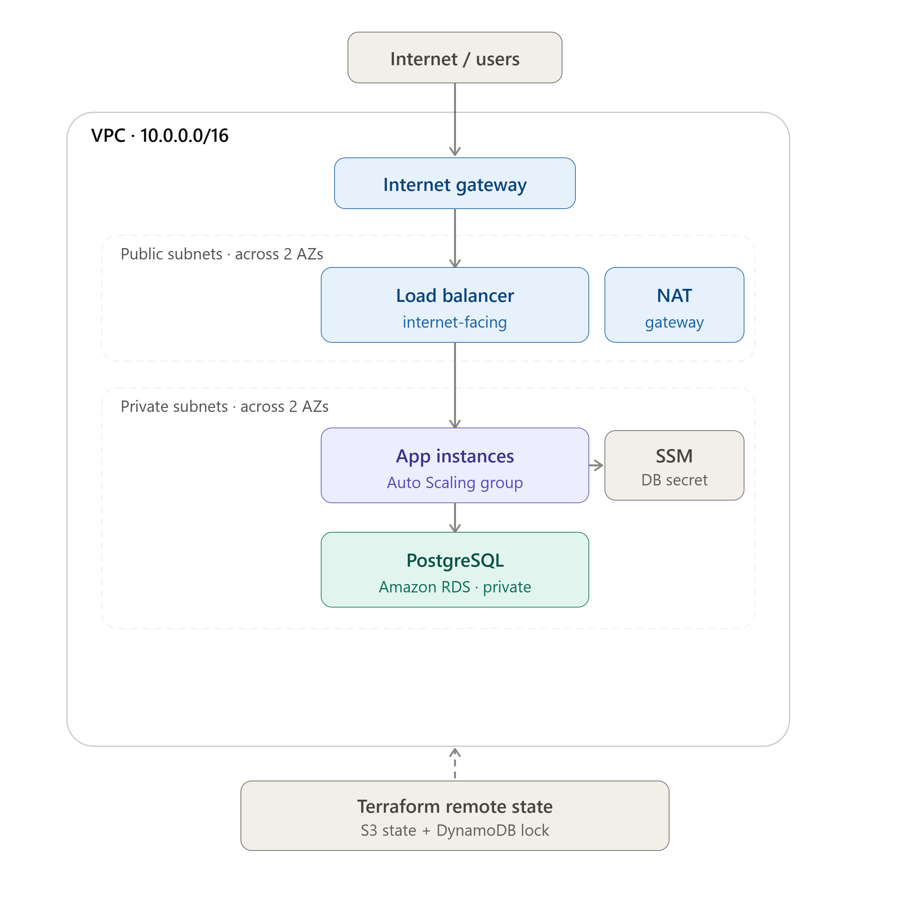

# Multi-Tier AWS Environment as Code

Provision a complete, production-shaped AWS environment with a single `terraform apply` — and tear it all down with a single `terraform destroy`. Networking, a load-balanced auto-scaling compute tier, and a private managed database, all defined as modular, reusable Terraform with remote state and two isolated environments.



> Replace the image above with your exported architecture diagram, and the demo below with your Phase 8 recording.

## What this demonstrates

A single command stands up a three-tier environment across two availability zones: a public load-balancer tier, a private auto-scaling application tier, and a private PostgreSQL database — with secrets handled through SSM, least-privilege IAM, remote state with locking, and a second staging environment built from the same modules. The whole thing is reproducible: destroying and rebuilding produces an identical environment every time.

## Demo: destroy and rebuild


The environment is fully reproducible from code. The recording above shows the complete stack destroyed to nothing, then rebuilt to a working application in a few minutes — no manual steps, no console clicking, no configuration drift.

## Architecture

Traffic flows internet → Application Load Balancer (public subnets) → application instances (private subnets) → PostgreSQL (private subnets). Each tier is locked to the one in front of it: the ALB accepts traffic from the internet, the app tier accepts traffic only from the ALB, and the database accepts traffic only from the app tier. Application instances reach the internet outbound through a NAT gateway but are not reachable from it.

The stack is composed of four modules called in dependency order:

- `networking` — VPC, public and private subnets across two AZs, internet gateway, NAT gateway, and route tables.
- `security` — three chained security groups (ALB, app, database) plus a least-privilege IAM role and instance profile.
- `compute` — an Application Load Balancer, target group with health checks, launch template, and an Auto Scaling group with a target-tracking CPU policy.
- `database` — a private RDS PostgreSQL instance, a DB subnet group, and SSM parameters holding the connection details and an auto-generated password.

## Repository layout

```
.
├── bootstrap/            # One-time setup: S3 state bucket + DynamoDB lock table
├── modules/
│   ├── networking/       # VPC, subnets, gateways, routing
│   ├── security/         # Security groups + IAM
│   ├── compute/          # ALB + Auto Scaling group
│   └── database/         # RDS + SSM parameters
├── envs/
│   ├── dev/              # Dev environment (calls all four modules)
│   └── staging/          # Staging — same modules, different variables
└── docs/                 # Architecture diagram, demo recording
```

## Prerequisites

An AWS account, Terraform 1.5+, and the AWS CLI configured with credentials (`aws sts get-caller-identity` should succeed). A billing budget alarm is strongly recommended before deploying — the NAT gateway, load balancer, and RDS instance all bill hourly.

## Deploying

The state backend is created once, before anything else:

```bash
cd bootstrap
terraform init && terraform apply
```

Note the S3 bucket name it outputs and set it as the `bucket` in each environment's backend configuration. Then deploy an environment:

```bash
cd ../envs/dev
terraform init
terraform plan
terraform apply
```

The `alb_url` output is the address of the running application. Refreshing it shows requests being distributed across instances.

## Tearing down

```bash
terraform destroy
```

The state backend in `bootstrap/` is intentionally left in place, since it holds the state for everything else and costs almost nothing to keep.

## Design decisions

**Bootstrap pattern for remote state.** Remote state needs somewhere to live, but that "somewhere" has to be created by Terraform too — a chicken-and-egg problem. The `bootstrap/` config solves it by creating the S3 bucket and DynamoDB lock table while keeping its own state local. Every other config then uses that bucket as an S3 backend with DynamoDB locking, so concurrent applies can't corrupt state.

**Modules as building blocks, environments as thin wrappers.** All infrastructure logic lives in `modules/`; each environment under `envs/` only supplies variables. This is what lets the same code produce two isolated environments — `dev` on `10.0.0.0/16` and `staging` on `10.1.0.0/16` — with separate state files in the same backend. Non-overlapping CIDRs are used deliberately so the VPCs could be peered later without conflict.

**Security group chaining over CIDR rules.** Each tier's security group references the previous tier's security group as its source rather than an IP range. Combined with placing the app and database in private subnets, this gives defense in depth: even within the VPC, only the load balancer can reach the app, and only the app can reach the database.

**Least-privilege IAM.** The instance role grants only CloudWatch Logs writes and SSM parameter reads, scoped by ARN to this project's own paths rather than using wildcards. The database password is generated at apply time, stored as an encrypted SSM `SecureString`, and never hardcoded or committed. (It does land in Terraform state, which is exactly why the state bucket is encrypted and access-blocked.)

**Auto Scaling group over a single instance.** The compute tier uses an ASG with ELB health checks and a target-tracking scaling policy, so unhealthy instances are replaced automatically and capacity follows CPU load — self-healing and horizontally scalable rather than a single point of failure.

**Dev-appropriate database settings.** RDS runs single-AZ with backups disabled and `skip_final_snapshot` enabled so teardown is clean and cheap. Production would flip these: multi-AZ, backup retention, deletion protection, and a required final snapshot.

## Cost notes

The main billed resources are the NAT gateway, the Application Load Balancer, the EC2 instances, and the RDS instance. Running `terraform destroy` between working sessions keeps costs negligible; a `db.t3.micro` and `t3.micro` instances stay within the AWS free tier. The most common source of surprise charges is a forgotten NAT gateway, so the console is worth a glance after each destroy.

## Possible extensions

CI/CD that runs `fmt`, `validate`, and `plan` on pull requests; HTTPS via an ACM certificate on the load balancer; security scanning with `tfsec` or `checkov`; and multi-region for disaster recovery.

> CI/CD: Every pull request runs an automated pipeline — format check, TFLint, tfsec security scan, validate, and plan — and posts the plan as a PR comment. AWS access uses short-lived OIDC credentials scoped to this repository, not stored keys. The CI role is read-only; applies would be gated behind manual approval.